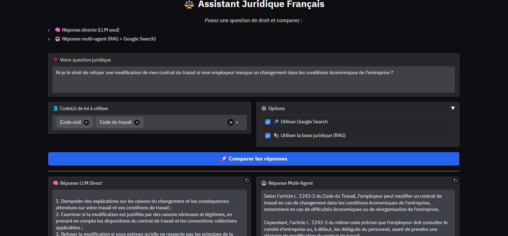

# ⚖️ Legal Multi-Agent System

A multi-agent system designed to answer legal questions in French using:
- Legal texts from [Legifrance](https://www.legifrance.gouv.fr/)
- Online search capabilities (SerpAPI)
- LLM models hosted on [Groq](https://console.groq.com/)

## 🚀 Features

- Automatic download of legal codes from the PISTE API (Legifrance)
- Structured parsing of articles in a LangChain-compatible format
- Expert agents (civil code, labor code, etc.)
- Master agent to route queries to the appropriate expert
- Optional web search via SerpAPI
- Detailed responses in French, including article citations


## 1. Environment Setup

Create and activate a virtual environment:
```
python -m venv venv
source venv/bin/activate  
```
On Windows: 
```
venv\Scripts\activate
```


Install dependencies:
```
pip install -r requirements.txt
```
Create a .env file with your API keys:


```
SERPAPI_API_KEY=your_serp_api_key
GROQ_API_KEY=your_groq_api_key
PISTE_API_CLIENT_ID=your_piste_api_client_id
PISTE_API_CLIENT_SECRET=your_piste_api_client_secret
HOST=your_host_for_fast_api_server
PORT= your_port_for_fast_api_server
```
| Variable                  | Description                                                              | Link                                                                                   |
|---------------------------|--------------------------------------------------------------------------|----------------------------------------------------------------------------------------|
| `SERPAPI_API_KEY`         | API key for performing Google searches via SerpAPI                       | [Create a SerpAPI account](https://serpapi.com/users/sign_up)                         |
| `GROQ_API_KEY`            | API key to access Groq's ultra-fast LLMs                                 | [Create a Groq account](https://console.groq.com/)                                    |
| `PISTE_API_CLIENT_ID`     | Client ID to access the Legifrance API via PISTE                         | [Register on PISTE](https://developer.aife.economie.gouv.fr/user/register)            |
| `PISTE_API_CLIENT_SECRET` | Secret key associated with your PISTE client ID                          | [Legifrance API on PISTE](https://developer.aife.economie.gouv.fr/legifrance)         |
| `HOST`                    | Address of the FastAPI server                                            | -                                                                                      |
| `PORT`                    | Port used by the FastAPI server                                          | -                                                                                      |


## 2. Initial Commands

Extract codes and articles using pylegifrance, they are by default saved in ```data/legifrance```
```
python extractor.py
```

List available law codes:
```
python main.py --mode list-codes
```
Build indices (stored in data/indices) for all available law codes, they are saved in ```data/indices```
```
python main.py --mode build-indices
```
Or for specific law codes:
```
python main.py --mode build-indices --law-codes civil penal
```

## 3. Running the System

Start the API server:
```
python main.py --mode api
```
In a separate terminal, start the UI:
```
python main.py --mode ui
```
Open your browser and navigate to the URL shown in the terminal (typically http://localhost:7860)



## 4. Data Format Expectations
The loader expects each law code JSON file in data/legifrance/ to contain an array of legal article objects, each with at least these fields:

id: Article identifier
content: Article text content
title: Article title (optional)

Example JSON structure:
```
json[
  {
    "id": "ARTICLE_123",
    "title": "Article relatif au divorce",
    "content": "Le divorce peut être prononcé en cas..."
  },
  {
    "id": "ARTICLE_124",
    "title": "Effets du divorce",
    "content": "Le divorce a pour effet de dissoudre..."
  }
]
```
This structure allows the system to properly index and retrieve relevant legal articles for each query.